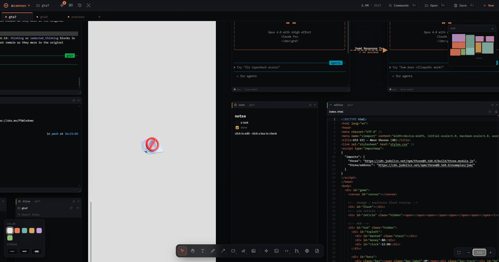

<div align="center">



<p></p>

[](https://tauri.app)
[](#stack)
[](src-tauri)
[](#quick-start)
[](LICENSE)

**An infinite canvas for driving Claude Code.**
*Excalidraw, but the boxes are real terminals, agents, and live previews.*

Spawn shells, Claude agents, editors, and VS Code onto a boundless dark
surface, then arrange them the way you'd sketch a whiteboard. Every tab is a
self-contained `.ccnvs` workspace you can save, reopen, and share.

</div>





## Why

A terminal multiplexer gives you panes; ccanvas gives you *space*. Lay out a
fleet of agents the way you'd sketch them on a whiteboard, watch each one's
status at a glance, and see how full each one's context is. When the canvas
gets crowded, the **agent roster**, **canvas search**, and a **tracking
camera** that orbits an agent's files keep you oriented.

This branch trims the toolbox down to what actually gets used driving
Claude day to day — agents, terminals, files, diffs, and editors — and
spends that space on making each of those sharper: a real VS Code, terminal
fidelity that matches your own shell, and drag‑and‑drop straight into a
running agent.

## What's new on this branch

| | |
| --- | --- |
| 🖥️ **VS Code, embedded** | `⌘⇧V` opens the real VS Code (`code serve-web`) as a widget, scoped to the canvas folder, with extensions from Open VSX — no separate window to manage. Needs the `code` CLI on PATH (VS Code → *Shell Command: Install 'code' command*); works in both the desktop app and the browser build |
| 🖼️ **Drag & drop into agents** | Drag a file — an image, a screenshot, anything — from Finder/Explorer straight onto a terminal or agent widget; it's pasted in as a path Claude Code reads as an attachment. The widget outlines while you're hovering over it. Desktop app only |
| 🎨 **Your terminal, not a generic one** | On macOS, terminal widgets pick up your default iTerm2 profile — font, cursor, ANSI palette — so a ccanvas terminal looks like the one you already live in; anything it can't read falls back to the built-in theme, as does every other platform today |
| 🧠 **Memory panel** | A side dock renders Claude's own cross-session memory for the bound folder as a force-directed graph — nodes, links, and types, read straight from `~/.claude/projects/…/memory/` each time you open it |
| 🔢 **Hold ⌘ to see terminal numbers** | Hold `⌘` for a beat and every terminal shows the digit that `⌘1`–`⌘9` jumps to; let go and they're gone again |
| 📛 **Agent titles that stay in sync** | A Claude agent widget adopts the name you `/rename` inside the session, or the title Claude generates after the first prompt, instead of sitting at "claude agent" forever |
| 🪶 **A slimmer toolbar** | Fewer buttons, same power — the vector-drawing tools and GitHub-issue widgets from upstream are gone from the chrome; the surface is just Claude, a shell, and the files between them |


## Quick start

### Desktop app (recommended): Tauri

```bash
npm install
npm run app        # dev: launches the native window
npm run app:build  # build an installer → src-tauri/target/release/bundle
```

The desktop build is the real thing: native folder/file dialogs, native file
IO, and an **in-process PTY** per terminal, a real shell with no separate server
and no WebSocket hop. Requires the Rust toolchain (`rustup`) and, on Windows,
the WebView2 runtime (preinstalled on Windows 11).

### Web app

```bash
npm run dev        # → http://127.0.0.1:5173
```

In the browser the canvas can't reach the filesystem on its own, so real
terminals + folders come from an optional local backend (run it in a second
terminal, or `npm start` to run both at once):

```bash
npm run server     # ws + http on 127.0.0.1:7531
npm start          # runs the pty server and the web app together
```

The backend gives the browser what the sandbox can't: a real shell per terminal
widget (via `node-pty`; prebuilt binaries ship for Windows/macOS) and a native
folder picker + file IO. Each **canvas is bound to a folder**: creating a new
canvas asks where to put its `.ccnvs`, and that folder becomes the working
directory every terminal/agent opens in. A **Claude agent** widget is just a
real terminal in the canvas folder with `claude` already running.

Terminal widgets auto-connect and fall back to a small in-browser shell when the
backend isn't running; the footer pill shows `pty` (live) or `local`
(fallback). Without the backend you can still bind a folder by typing a path.
File drag-and-drop needs the desktop app; the VS Code widget works here too.


## What's in here

| Surface | Notes |
| --- | --- |
| **Infinite canvas** | Pan (`H` / middle-mouse / two-finger scroll), smooth zoom (⌘/Ctrl-scroll), dot grid, minimap |
| **Quick insert** | `Space` drops text at the cursor; press `/` then a widget name (`agent` `term` `files` `diff` `editor` `note`) to spawn one |
| **Command palette** | ⌘/Ctrl-K to spawn widgets, arrange, switch tabs, open panels, insert prompts, export, or jump to a widget |
| **Widgets** | Claude agent · Terminal · Transcript · File tree · Git panel · Editor (Monaco) · **VS Code** · Markdown note |
| **Drag & drop** | Drop a file from the OS onto a terminal or agent to paste its path in — the way you'd hand Claude a screenshot |
| **Agent orchestration** | Per-agent activity dot (idle/working/waiting), idle notifications, broadcast-to-many, per-agent model/prompt/flags |
| **Context meter** | Each agent's bar shows how full its context window is (read from its session transcript), with a one-click **compact** past 70% |
| **Plan usage** | The top-bar pill shows Claude's own session and weekly limit % with reset times, using your Claude Code sign-in (desktop app); falls back to a local token estimate |
| **Memory panel** | Claude's cross-session memory for the bound folder, rendered as a graph you can pan, filter by type, and click into |
| **Agent roster** | Mission-control list of every agent across all tabs: status, cost/turns, last line, click-to-focus, and a composer to message one or broadcast to all |
| **Tracking camera** | Follow an agent and watch every file it touches spawn as a viewer in an **orbit** around it, arrows pointing back; the camera stays framed on the action |
| **Transcript widget** | An agent's *real* conversation rendered from its session JSONL: clean text + tool chips, free of terminal box-drawing chrome, following the session live |
| **Checkpoints** | Git-backed working-tree snapshots: save a point before letting an agent loose, restore tracked files if it makes a mess |
| **Prompt library** | Reusable prompt snippets you can insert into the focused agent, drag onto any agent, or manage; persisted like layout templates |
| **Canvas search** | ⌘/Ctrl-F to fuzzy-search every element's text (titles, notes, paths, URLs, prompts, queries, frame names) and jump to it |
| **Follow active agent** | A headless camera mode that pans to whichever agent most recently started working |
| **Arrange** | Group, lock, align, distribute, tidy, copy/paste/duplicate, z-order, snapping guides, transform handles, minimap |
| **Right-click menus** | Custom context menus: canvas elements (duplicate, lock, z-order, delete), agents (track, transcript, label box), file-tree rows (open, **reveal in Explorer/Finder**, copy path), empty canvas (paste, select all) |
| **Tabs** | Multiple `.ccnvs` workspaces open at once, each bound to its own folder |
| **Persistence** | Save/Open into the canvas folder (backend) or File System Access API; reusable widget-layout templates; PNG/SVG export |


## Watching agents work

The canvas is great for layout but poor at *"is anything stuck?"*, so these
three features are the answer at scale:

- **Agent roster** (command palette → *Agent roster*): every agent across every
  tab in one list, with live status, cost and turn count, and its last line of
  output. Click a row to fly the camera to that agent; type in the composer to
  message one agent or broadcast to all.
- **Tracking camera** (right-click an agent → *Track this agent*): as the agent
  reads and writes files, each one opens as a viewer widget arranged in an orbit
  around it with a dashed arrow pointing back (`read` arrows are labelled). The
  camera reframes to keep the agent and its satellites in view. Stop keeps the
  files; **Stop & clear** removes the orbit. Driven entirely by the agent's
  session transcript, so it sees the real tool calls.
- **Follow the active agent** (command palette → *Follow the active agent*): a
  lightweight mode that just pans to whichever agent most recently started
  working. It stands down while the tracking camera is active.

## Safety net: checkpoints

Before turning an agent loose on your working tree, drop a **checkpoint**
(command palette → *Checkpoints*). Each one is a real git object created with
`git stash create` and pinned under `refs/ccanvas/cp/<id>` so gc never collects
it, and it snapshots tracked changes **without** touching your working tree or
the stash list. Restore is deliberately non-destructive: it resets tracked
content to the snapshot but never deletes files the agent created afterwards.
(Untracked files at checkpoint time aren't captured.) Requires the canvas folder
to be a git repo.


## Keyboard

| Key | Action |
| --- | --- |
| drag empty canvas / `Shift`-drag | pan · box-select |
| `Space` | quick-insert text or `/command` widget at the cursor |
| ⌘/Ctrl + `K` | open / close the command palette |
| ⌘/Ctrl + `F` | search this canvas |
| drag empty canvas / middle-drag | pan |
| ⌘/Ctrl + scroll | zoom to cursor |
| ⌘/Ctrl + `S` / `O` / `N` | save · open · new canvas |
| ⌘/Ctrl + `T` / `Shift T` | new terminal · new Claude agent |
| ⌘/Ctrl + `Shift V` | new VS Code widget for this canvas's folder |
| hold ⌘/Ctrl | show the jump-number on every terminal |
| ⌘/Ctrl + `1`–`9` | jump to and focus the Nth terminal |
| ⌘/Ctrl + `Shift ]` / `[` | next · previous terminal |
| ⌘/Ctrl + `W` | close the focused widget (quits the desktop app when none are left) |
| ⌘/Ctrl + `Z` / `Shift Z` | undo · redo |
| ⌘/Ctrl + `C` / `X` / `V` / `D` | copy · cut · paste · duplicate |
| ⌘/Ctrl + `G` / `Shift G` | group · ungroup |
| ⌘/Ctrl + `L` | lock / unlock selection |
| ⌘/Ctrl + `[` / `]` | send to back / bring to front |
| ⌘/Ctrl + `A` | select all |
| ⌘/Ctrl + `0` `+` `-` | reset / zoom in / zoom out |
| `Delete` | delete selection |
| `Esc` | back to select |
| double-click | edit text · interact with widget · rename widget/tab |

## Stack

Vite · React · TypeScript · Zustand · xterm.js · Monaco · **Tauri 2** (Rust). The
same frontend runs as a native desktop app or in the browser; native
capabilities sit behind a small abstraction that picks the best available
backend.

## Architecture notes

- **`src/store/workspace.ts`**: single Zustand store; the active workspace is the
  source of truth and what serializes to `.ccnvs`.
- **`src/canvas/`**: pointer/zoom state machine, SVG vector layer, inline text.
- **`src/widgets/`**: `WidgetFrame` chrome (drag/resize/z-order) plus per-type
  bodies (terminal, transcript, editor, `VsCodeBody`, diff, data, plot, …).
- **`src/lib/backend.ts`**: native dialog/file IO, choosing Tauri commands → HTTP
  bridge → graceful no-op by `isTauri()`.
- **`src/lib/terminal.ts`**: terminal transport, choosing in-process Tauri PTY →
  WebSocket bridge → in-browser fallback shell.
- **`src/lib/termProfile.ts`**: reads the user's own terminal look (font, cursor,
  palette) from the machine and feeds it to xterm as the widget's theme.
- **`src/lib/fileDrop.ts`**: listens for the OS drag-drop the webview otherwise
  swallows, finds the terminal/agent under the cursor, and pastes the dropped
  paths in as a bracketed paste.
- **`src/lib/transcript.ts`**: reads and parses Claude Code session JSONL (last
  turn for flow piping, touched files for the tracking camera, full conversation
  for the transcript widget).
- **`src/lib/tracker.ts`**: the tracking camera, which polls a transcript, spawns
  satellite viewers in an orbit, and keeps the camera framed.
- **`src/lib/checkpoints.ts`**: git-backed working-tree checkpoints.
- **`src-tauri/`**: the Rust app: `src/pty.rs` (a `portable-pty` shell per widget,
  streaming `pty:data`/`pty:exit` events), `src/editor.rs` (the VS Code
  `serve-web` process + local proxy), `src/term_profile.rs` (reads the host
  terminal's theme), and `src/files.rs` (native dialogs + fs).
- **`server/pty-server.mjs`**: the optional web-mode backend (same protocol, over
  `ws`/`http`) for when you run in a plain browser.


<div align="center">
<sub>See <a href="CONTRIBUTING.md">CONTRIBUTING.md</a> to hack on it · <a href="LICENSE">LICENSE</a></sub>
</div>
